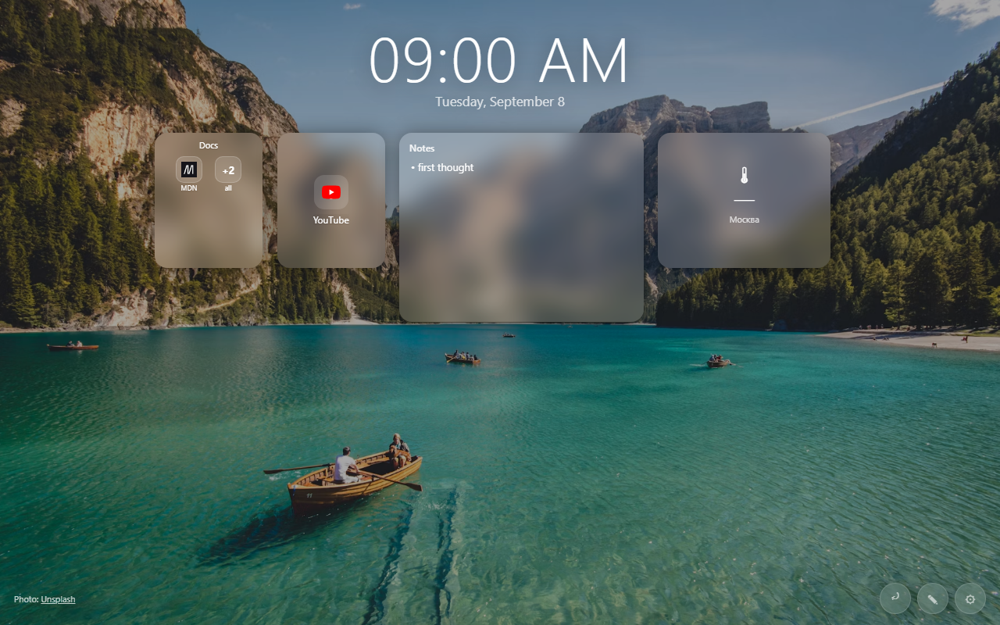

# R.Db — рабочий стол новой вкладки



Минималистичный дашборд в духе Bonjourr и Homarr: папки в стиле OnePlus, свободно расставляемые виджеты, свои фоны. Всё хранится локально в браузере, сервер и аккаунт не нужны.

## Возможности

- **Папки OnePlus** — ссылки прямо внутри виджета, остаток сжимается в кнопку `+N`; вложенность без ограничений
- **9 виджетов**: ссылка, папка, заметка, чек-лист, погода-конструктор (текущая + часы + дни), курсы валют, крипта, цитата дня
- **Свободная доска** — drag & drop и ресайз без налезания друг на друга, всё в пределах одного экрана без прокрутки
- **Фоны как в Bonjourr** — карусель Unsplash, свои картинки/файлы, блюр и затемнение
- **Автоиконки как в Heimdall** — узнал `proxmox`/`pihole`/`jellyfin` → подтянул фирменную иконку
- **Автоназвания ссылок** — вставил URL, `<title>` подтянулся сам
- **RU/EN** с автоопределением языка браузера, тёмная/светлая темы
- **Firefox Sync**: настройки и виджеты тянутся между устройствами (лимит синка ~100 КБ — фото-фон лучше держать ссылкой, а не файлом)
- Правая кнопка везде: контекстные меню и быстрое создание

## Установка как расширения

**Firefox:** `about:debugging` → This Firefox → Load Temporary Add-on → выбрать `manifest.json`.
(Временно — слетает после рестарта; навсегда — подпись на addons.mozilla.org, бесплатно.)

**Chrome:** `chrome://extensions` → Developer mode → Load unpacked → папка проекта.
(Для Web Store нужна публикация — $5 разово.)

## Разработка

Никакой сборки — чистые HTML/CSS/JS. Локальный запуск:

```bash
cd R.Db
python -m http.server
```

Структура: `index.html` — разметка, `style.css` — стекло и анимации, `app.js` — всё остальное,
`manifest.json` — обёртка расширения, `icons/` — иконки.

## Приватность

Данные (ссылки, заметки, настройки) лежат только в `localStorage`/`storage.sync` твоего браузера.
Сеть используется лишь для: фонов Unsplash, иконок, погоды (Open-Meteo), валют (open.er-api.com),
крипты (CoinGecko) и названий ссылок (microlink/noembed). Аккаунтов и телеметрии нет.

## Лицензия

GPL-3.0 — см. файл [LICENSE](LICENSE).
